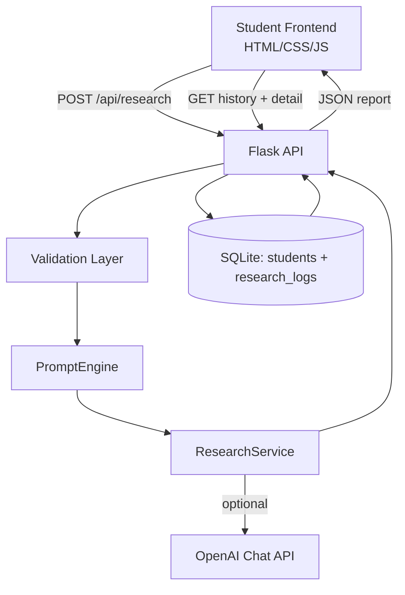

# AI Student Research Assistant

A full-stack platform that helps students do deep, scientist-style research with automatic report generation, PPT outline creation, viva prep, and history tracking.

## Features delivered
- Research query intake from a student UI.
- Deep-research synthesis pipeline with:
  - Literature review (simulated Google Scholar, IEEE Xplore, PubMed)
  - Scientific explanation
  - Research gap detection
  - Research proposal/methodology generation
- Structured research report output:
  - Abstract, Introduction, Literature Review, Methodology, Simulated Results, Conclusion, References
- Auto-generated PPT outline and viva questions.
- Dataset and tools suggestions.
- Student-wise research history and report retrieval.

## 1) Architecture diagram


## 2) Database schema
- `students(id, name, email UNIQUE, institution, created_at)`
- `research_logs(id, student_id FK, topic, query, report_json, created_at)`

SQL reference: `docs/schema.sql`.

## 3) Project structure
```text
.
├── app.py
├── research_engine.py
├── docs/schema.sql
├── static/
│   ├── app.js
│   └── styles.css
├── templates/index.html
├── tests/
│   ├── test_research_engine.py
│   └── test_schema_sql.py
├── requirements.txt
└── Procfile
```

## 4) Run locally (step-by-step)
```bash
python -m venv .venv
source .venv/bin/activate
pip install -r requirements.txt
python app.py
```
Open `http://localhost:5000`.

## 5) API endpoints
- `GET /api/health`
- `POST /api/research`
- `GET /api/history/<student_id>`
- `GET /api/history/detail/<research_id>`

## 6) AI prompt engine and model strategy
- `PromptEngine` creates system/user prompts.
- `ResearchService` tries OpenAI API if `OPENAI_API_KEY` is configured.
- If unavailable, it safely falls back to deterministic local synthesis so the app still works.

Environment variables:
- `OPENAI_API_KEY` (optional)
- `OPENAI_MODEL` (optional, default `gpt-4o-mini`)
- `DATABASE_URL` (optional, default SQLite)

## 7) Deploy guide
### Render / Railway / Heroku
1. Push repository to GitHub.
2. Create a Python web service.
3. Build command: `pip install -r requirements.txt`
4. Start command: `gunicorn app:create_app`
5. Set env vars as needed (`DATABASE_URL`, `OPENAI_API_KEY`, `OPENAI_MODEL`).

Heroku Procfile already included.

## 8) Student-friendly explanation
1. Enter your name, email, topic, and research question.
2. Click **Generate Deep Research**.
3. Read all report sections.
4. Use generated PPT outline to build slides.
5. Practice viva questions.
6. Use your Student ID to load old reports anytime.
